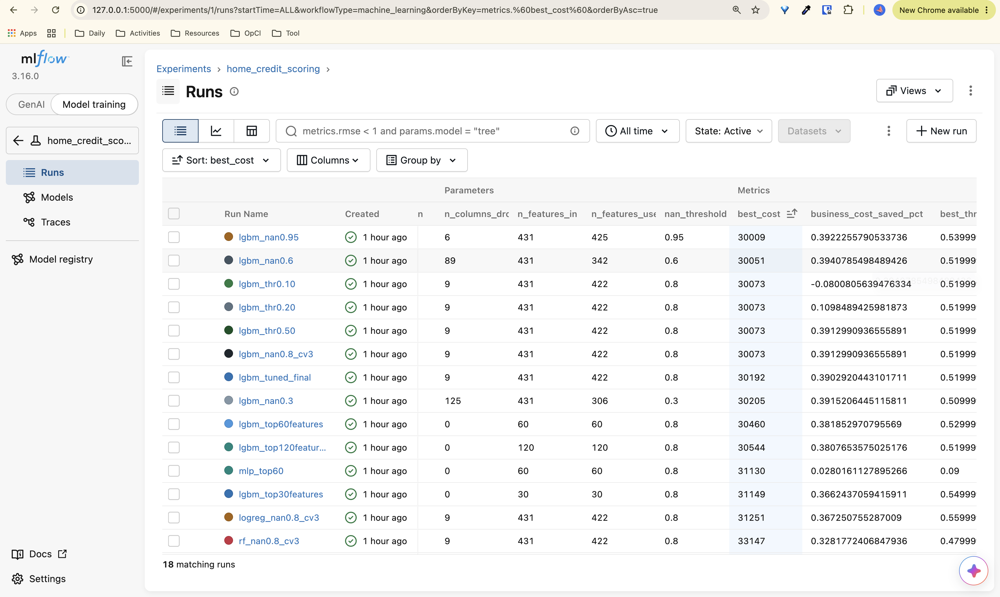
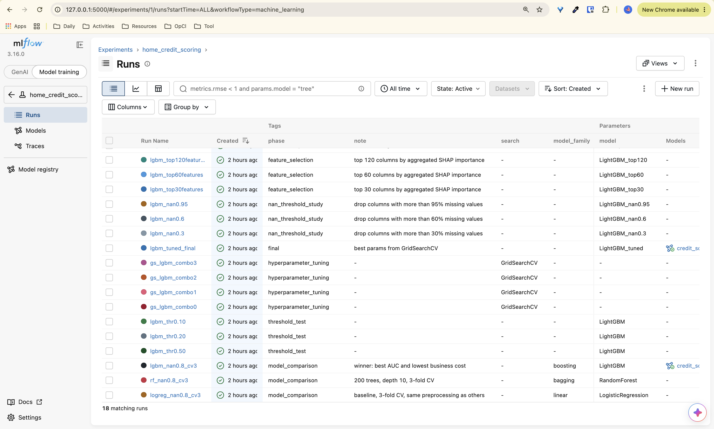
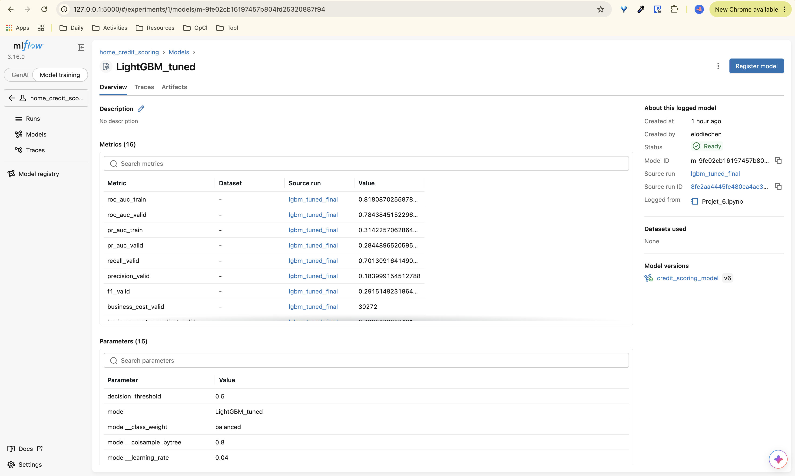

# Credit Scoring Model — Home Credit Default Risk

OpenClassrooms project "Initiez-vous au MLOps" (part 1): build a credit scoring
model, optimise it on a business cost, and track every experiment with MLflow.

## Overview

| Step | What is done |
|---|---|
| Data | 7 Home Credit tables aggregated at client level (`SK_ID_CURR`) |
| Models | Logistic Regression, Random Forest, LightGBM, MLP |
| Business metric | cost = 10 × false negatives + 1 × false positives |
| Tuning | GridSearchCV scored on the business cost, decision threshold optimisation |
| Explainability | SHAP (global importance, local explanations per confusion-matrix quadrant) |
| Tracking | MLflow: parameters, metrics, artifacts, model registry |

## Final model

LightGBM inside a scikit-learn Pipeline (imputation, scaling, one-hot encoding),
trained on the 60 most important features selected with SHAP. Registered in MLflow
as `credit_scoring_model`, alias `champion` (version 8). It costs 0.7 % more than
the full 422-feature model, for 7 times fewer input columns.

| Metric (validation set) | Value |
|---|---|
| Business cost per client | 0.4943 |
| Decision threshold | 0.54 |
| ROC AUC | 0.7832 |
| PR AUC | 0.2813 |

## MLflow tracking





## Repository

    Projet_6.ipynb    full pipeline: exploration, aggregation, modelling, SHAP, MLflow
    screenshots/      MLflow UI screenshots

## How to run

1. Download the data from
   [Kaggle](https://www.kaggle.com/competitions/home-credit-default-risk/data)
   and unzip it at the root of the project.
2. Install the dependencies (Python 3.12):

   ```bash
   pip install pandas==2.3.3 scikit-learn==1.9.0 lightgbm==4.6.0 mlflow==3.16.0 shap missingno
   ```

3. Run `Projet_6.ipynb`, then open the MLflow UI:

   ```bash
   mlflow ui
   ```

   and browse http://127.0.0.1:5000.